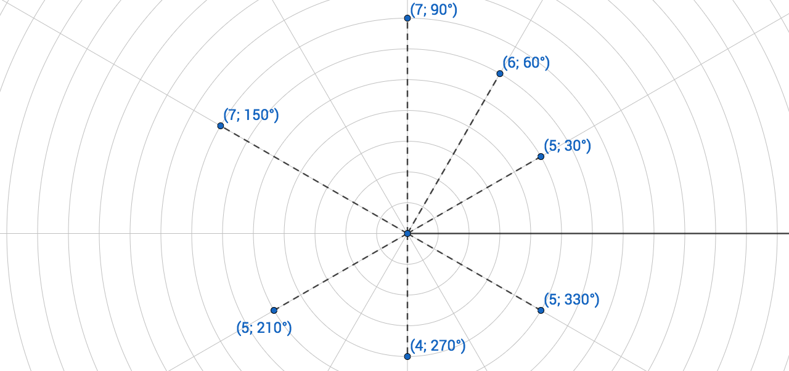

# Table of Content{#toc}

<!-- MarkdownTOC depth=2 -->

- [極坐標](#polor)
- [極坐標與直角坐標系統的轉換](#convert)

<!-- /MarkdownTOC -->

# 極坐標 {#polor}

  <iframe
  scrolling="no"
  allowfullscreen
  title="Incenter"
  src="https://www.geogebra.org/material/iframe/id/xu6x3hMA/width/1280/height/647/border/888888/smb/false/stb/false/stbh/false/ai/false/asb/false/sri/false/rc/false/ld/false/sdz/false/ctl/false"
  width="1280"
  height="647"
  style="border:0px;"> </iframe>

# 極坐標與直角坐標系統的轉換{#convert}
$$
\begin{matrix}
(x, y) = (r\cos\theta, r\sin\theta) \\
\\
\text{其中} \; r^2=x^2+y^2
\end{matrix}
$$